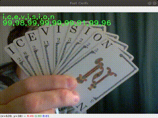
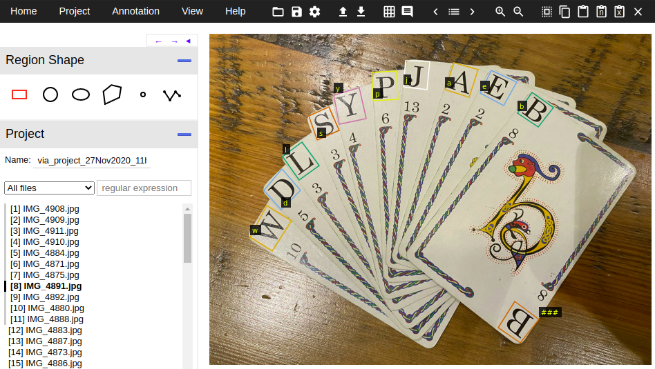
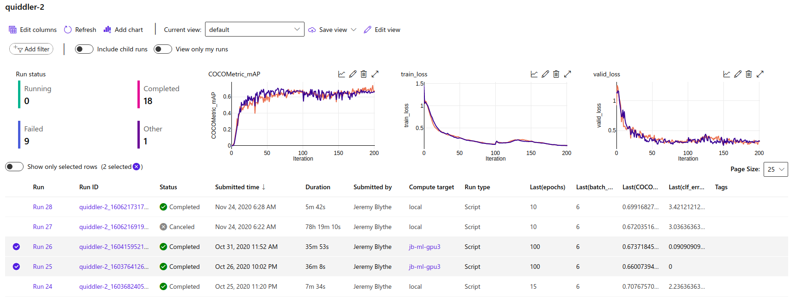
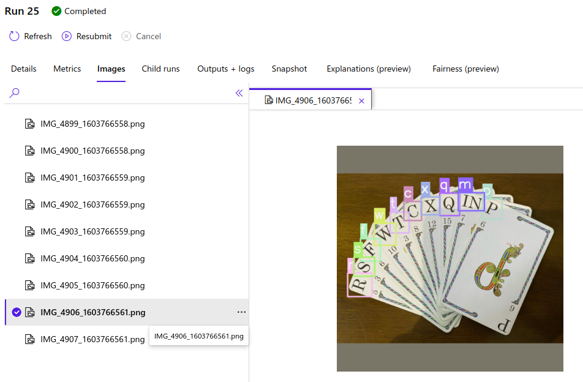
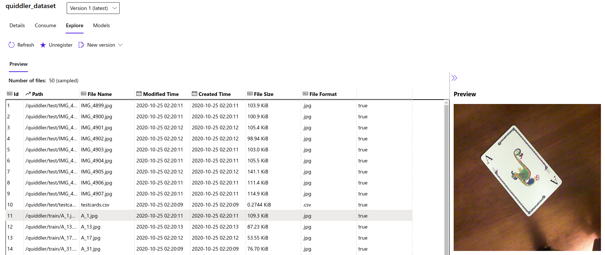
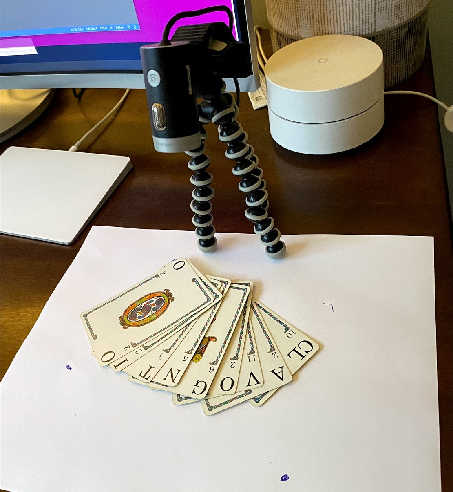

### Quiddler
Quiddler is a simple card game where you compete to make high scoring words from your hand of cards. Imagine Scrabble but as a card game.

This project is really an excuse to learn some ML and CV. It's purposefully an end-to-end project for that reason. From taking the photos and data labelling through training and tuning to inference and ultimately the full game.



The gif above doesn't really do this justice. This actually runs at around 25fps. The point of this webcam script though was to practically see how well the model was trained for changes in orientation and size. In the real game setting there are fixed cameras and the cards are placed on a flat surface.

### VGG Image Annotator (VIA)
I used [VIA](http://www.robots.ox.ac.uk/~vgg/software/via/) to label 120 photos taken with an iPhone or webcam.



### IceVision and fastai
The object detection model is provided by the awesome [IceVision](https://airctic.com/) project in [fastai](https://docs.fast.ai/) mode. To train the model to adequate performance I have not needed to do very much tweaking beyond picking appropriate training augmentations. 

### AzureML
I happened to also be learning AzureML so I threw this into the mix too. There a couple of notebooks here that use the AzureML SDK to run training and inference services.



A simple callback in fastai is used to send metrics to the AzureML Workspace. Also, images and tables of results can be logged as part of the run:



And, of course, the Quiddler dataset itself is stored and registered in the workspace:



### The Game
On your turn you need to try to make the best scoring word or words from your hand. You can also substitute one of your cards with the card face up on the discard pile. Or choose the next unseen card from the face-down deck. The complication for the algorithm is that you're not trying to make the longest single word but to use up all the cards in your hand on multiple words. Also, some of the cards are double-letter cards, `IN` for example.

Prefix Trees are used to hold the structure for all possible words and the permutations given the double-letter cards. For example the word: "inquiring" can be constructed from the cards in 8 ways: 
```
            'in/qu/i/r/in/g': 36,
            'in/qu/i/r/i/n/g': 36,
            'in/q/u/i/r/in/g': 46,
            'in/q/u/i/r/i/n/g': 46,
            'i/n/qu/i/r/in/g': 36,
            'i/n/qu/i/r/i/n/g': 36,
            'i/n/q/u/i/r/in/g': 46,
            'i/n/q/u/i/r/i/n/g': 46
```

As the game progresses you start each round with an increasing number of cards in your hand. The last round has 10 cards.

The service created here, and hosted via AzureML takes the number of cards (the round your on), an image for your hand and an image for the deck card. It then returns the best possible play - whether to pick-up the deck card, which card to discard and the words to make:
```
Hand:     a/cl/g/in/th/m/p/o/u/y
Deck:     n
Score:    58
Complete: True
Words:    ['cl/o/th', 'm/u/n/g', 'p/in/y']
Pick up:  n
Drop:     a
```
[This notebook](https://github.com/jerbly/quiddler/blob/main/game/game.ipynb) shows the flow and interaction with a local AzureML service.

